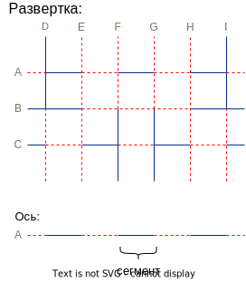

# Teaching and Research Topic: Create a theory and software to study the orientations of fold lines when folding a sheet of paper multiple times.

Tasks:

- The result of folds is given, to restore the sequence of fold axes and, in general, the possibility of obtaining such a pattern of folds; write a program that performs these operations
- Come up with and write a series of theorems about how the orientations of the fold lines can and cannot look like
- Create a gaming site where tasks of the form will be generated (there should also be a convenient interface for entering solutions and checking answers)

> The robot assembles the structure by bending the sheet. The figure shows the task for the robot: the solid line shows the folds in one direction, the dotted lines in the other.

The control is carried out by specifying the bend axes (the axis is specified by one letter, after each bend some axes are combined with each other, in such cases it does not matter which axis to specify).

Specify the sequence of bend axes so that the structure acquires the most collapsed appearance. The direction of the fold is determined by the robot itself, however, if the assembly program cannot be implemented, it stops its work.”

Task comment

**Answer: BEHC(A)D(F)G(I)**

> Underlined pairs can be rearranged, and the letter in brackets can be replaced by the letter in front of it. There are 16 correct lines in total.


To run the project:

1. Download [node.js](https://nodejs.org/en/)
2. Run in console:
   (Open one more console in directory \PaperTeam and type if need):

```
git clone https://github.com/kyzinatra/PaperTeam.git
```

```
cd web/
npm install
npm run dev
```

```
cd web/
npm run build
```

```
npm install
npm run listen
```

Open localhost:9000

Console API:

```sh
set $AXIS$ : 10..101 // Sets the $AXIS$ axis according to the pattern
```

```sh
set (width|height) int // Sets the height or width (width + height <= 28)
```

```sh
clear // Clear console
```

```sh
json get // get json from the constructor
```

```sh
difficulty (1|2|3) // set difficulty
```


# Доки
# Дока

[GitHub - kyzinatra/PaperTeam](https://github.com/kyzinatra/PaperTeam)

# Оглавление

типа да

# Формулировка задания

дадад

# Анализ задания

## Терминология:

Сегмент - отрезок на оси, лежащих между двумя соседними, перпендикулярными данной осями. Имеет тип один из двух типов поворота. В алгоритме *Segment.*

Ось - упорядоченный набор сегментов. Каждая ось имеет название по заглавной букве английского алфавита. (*Axis)*

Развертка - набор вертикальный и горизонтальных осей. (*Pattern)*

Решение развертки - совокупность всех способов ее сложить, так, чтобы получить наименьшую площадь.



## Требования к развертке:

Размеры крайних сегментов должны быть меньше размеров ячейки сетки. Они задаются в долях (0,1] от размера некраевого сегмента.

В развертке обязательно должна быть хотя бы одна вертикальная и хотя бы одна горизонтальная ось. Оси должны называться заглавными буквами латиницы, в порядке: горизонтальные оси сверху вниз, вертикальные слева направо.

# Алгоритм

## Алгоритм поиска одного пути:

*Целевой разверткой* называем развертку, решение которой будем искать.

подготовка:
Взять чистую развертку такого же размера и задать всем ее сегментам один и тот же тип поворота. Далее будем ее называть п*редставление*.

алгоритм от представления:
    Найти эквивалентные оси между представлением и целевой разверткой
    если они есть:
       Светнуть представление по эквивалентной оси (обновить его вид, запомнить связи между сегментами, отметить ось как сгиб)
       записать ось
       запустить алгоритм от измененного представления
    иначе:
        конец. все записанные оси составляют решение

эквивалентными осями считаются равные, либо полностью 	противоположные (все сегменты попарно противоположны)

```
in: ptrn         // целевая развертка
image(ptrn.size) // представление
ans = ""

*func* **alg**(ptrn)
		eq_axis = image.get_eq_axis(ptrn)
		*if* eq_axis *do*
				image.foldByAx(eq_axis)
				ans += eq_axis
				**alg**(ptrn)

out: ans
```

## Сущности

Далее приведено описание основных сущностей, которыми оперирует алгоритм, их полей и основных методов.

---

Объект типа *Segment* хранит данные о каждом сегменте в развертке.

Объект типа *Pattern* - это представление *развертки.* Она вводится в программу и нигде далее не изменяется. Поля *horiz* и *vert* хранят словари осей, где ключом является название оси, а данными список сегментов. 

```python
class Segment:
	**state**: bool
	**axis**: char
	**pos**: int
	**isFold**: bool # для TargetPattern

class Pattern:
	**horiz**: {’A’:[Segment,  ...], ‘B’: [Segment, ...]}
	**vert**: {’C’:[Segment,  ...], ... ‘I’: [Segment, ...]}
	**paddings**: {'top': 1, 'right': 1, 'bottom': 1, 'left': 1}
```

Поле *paddings* размеры краевых сегментов. Эти данные учитываются при подсчете площади развертки. На рисунке 2 показано, какие ключи за какие размеры отступов отвечают.


            Рисунок 2. Paddings.

---

 

```python
class Links:
	**links**: {{&Segment, &Segment ...}, 
					{&Segment, &Segment ...}
					...}
	
	def **setLink**(seg1, const_seg)

class TargetPattern(Pattern):
	**vert: ... # наследутся из Pattern
	horiz: ...
	valid_vert: ...  # та же структура данных, что и в vert
	valid_horiz: ...  # та же структура данных, что и в vert**
	**links**: Links 
	
	**def FoldByAx(ax)
	def findSimilarAxis(Pattern)
	def updateSquare()**
```

---

```python
class SolutionTree(Tree):
	**ptrn**: Pattern
	**tp**: TargetPattern
	**doublesPaths:** lst
	
	def __**create_tree_alg2**(parent='root')
	def __**create_tree_alg1**(parent='root')
	
	def **get_best_paths**(lg_type=1)
```

SolutionTree наследует класс Tree из [библиотеки treelib](https://treelib.readthedocs.io/en/latest/).

## Примеры использования

```python
>>> from Patterns import Pattern

>>> ptrn = Pattern("ptrn.json")
>>> ptrn.visualizate()

		 D   E   F   G   H   I
     ┆   ┃   ┃   ┃   ┃   ┆
 A───+┅┅┅+───+┅┅┅+───+┅┅┅+───+
     ┆   ┃   ┃   ┃   ┃   ┆
 B┅┅┅+┅┅┅+───+───+───+┅┅┅+┅┅┅+
     ┃   ┃   ┆   ┆   ┃   ┃
 C┅┅┅+───+┅┅┅+───+┅┅┅+───+┅┅┅+
     ┃   ┃   ┆   ┆   ┃   ┃

>>> ptrn.prnt()
horiz: {'A': [1 A0, 0 A1, 1 A2, 0 A3, 1 A4, 0 A5, 1 A6], 
				'B': [0 B0, 0 B1, 1 B2, 1 B3, 1 B4, 0 B5, 0 B6],
			  'C': [0 C0, 1 C1, 0 C2, 1 C3, 0 C4, 1 C5, 0 C6]} 
vert:  {'D': [0 D0, 0 D1, 1 D2, 1 D3], 'E': [1 E0, 1 E1, 1 E2, 1 E3], 
				'F': [1 F0, 1 F1, 0 F2, 0 F3], 'G': [1 G0, 1 G1, 0 G2, 0 G3], 
				'H': [1 H0, 1 H1, 1 H2, 1 H3], 'I': [0 I0, 0 I1, 1 I2, 1 I3]}

>>> from SolutionTree import SolutionTree
>>> sTree = SolutionTree(ptrn)
>>> sTree.get_best_paths(alg_type=1)

['EHBDGA', 'EHBGDA', 'EHBDGC', 'EHBDIA', 'EHBDIC', 'EHBFGA', 
'EHBFGC', ... 'HEBIFA', 'HEBIFC']
```

```python

```

# Сайт

## Технологи

*Все технологии сайта подразделяются на 2 категории. (Сайт написан полностью вручную не используя no-code, CMS и Site generators)*

- Frontend:
    - **Webpack**
    - Sass
    - **React**
    - **Typescript**
    - Redux (redux toolkit)
    - Uid
    - React-router
    - Axios

- Backend:
    - **Typescript**
    - **Express**
    - **Ts-node**
    - Nodemon
        
        

Полный список технологий можно посмотреть на [github](https://github.com/kyzinatra/PaperTeam)

в файлах

`package.json` — *для backend*

`src/package.json` — *для frontend*

## Хостинг

В качестве хостинга используется *heroku* с 1000 бесплатными часами в месяц c node и pyhton билдом (Что более чем достаточно для 1 проекта *24*30 = 720*)

## Процесс разработки

1. Перед стартом разработки необходимо определится с дизайном будущего сайта. Для этого используется *figma.*
    
    **[Исходный дизайн](https://www.figma.com/file/JYNq2eo1YU3GJtWiEA1wzC/PaperTeam?node-id=0%3A1)**
    
2. Создаем репозиторий на *github.* В корне проекта будет распологаться 2 папки: `server` и `web` — для *backend* и *frontend* разработки соответственно
3. Создадим структуру папок и начнем модульную разработку применяя `Flux` архитеркуру в нашем приложении
4. Пропишем основные методы get в *backend* и можем запускать с помощью *heroku* наш сайт

На сайте используется самописная консоль со следующим api:

```bash
difficulty (1|2|3) // set difficulty

set $AXIS$ : 10..101 // Sets the $AXIS$ axis according to the pattern

set (width|height) int // Sets the height or width (width + height <= 26)

clear // Clear console

json get // get json from the constructor
```

Исследовать сайт вы можете перейдя по [ссылке](https://paperteam.herokuapp.com/) (также доступна мобильная версия)