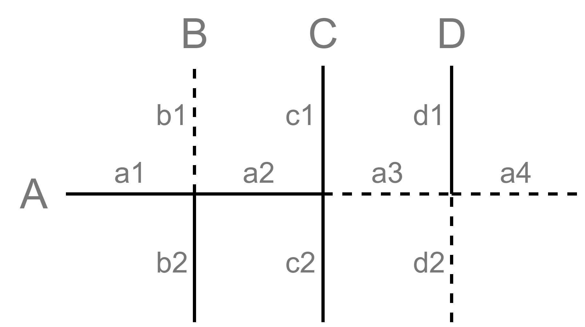
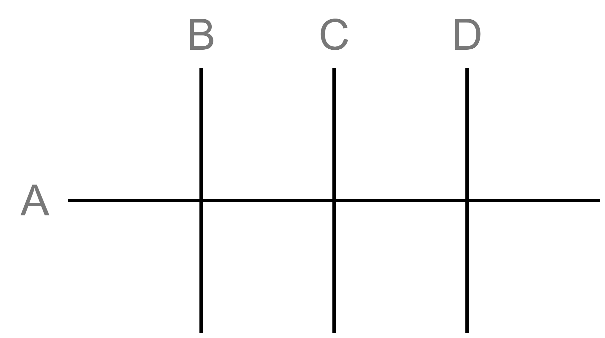

# Teaching and Research Topic: Create a theory and software to study the orientations of fold lines when folding a sheet of paper multiple times.

# Оглавление

* [Формулировка задания](#формулировка-задания)
* [to-run-the-project](#to-run-the-project)
* [Анализ задания](#анализ-задания)
	* [Терминология](#терминология)
	* [Требования к развертке](#требования-к-развертке)
* [Алгоритм](#алгоритм)
	* [Представление развертки и связи сегментов](#представление-развертки-и-связи-сегментов)
	* [Алгоритм поиска одного пути](#алгоритм-поиска-одного-пути)
	* [Алгорит поиска всех путей](#алгоритм-поиска-всех-путей)
	* [Сущности](#сущности)
	* [Примеры использования](#примеры-использования)
	* [Проблемы алгоритма](#проблемы-алгоритма)
* [Сайт](#сайт)
	* [Технологии](#технологии)
	* [Хостинг](#хостинг)
	* [Процесс разработки](#процесс-разработки)

# Формулировка задания
Tasks:

- The result of folds is given, to restore the sequence of fold axes and, in general, the possibility of obtaining such a pattern of folds; write a program that performs these operations
- Come up with and write a series of theorems about how the orientations of the fold lines can and cannot look like
- Create a gaming site where tasks of the form will be generated (there should also be a convenient interface for entering solutions and checking answers)

> The robot assembles the structure by bending the sheet. The figure shows the task for the robot: the solid line shows the folds in one direction, the dotted lines in the other.

The control is carried out by specifying the bend axes (the axis is specified by one letter, after each bend some axes are combined with each other, in such cases it does not matter which axis to specify).

Specify the sequence of bend axes so that the structure acquires the most collapsed appearance. The direction of the fold is determined by the robot itself, however, if the assembly program cannot be implemented, it stops its work.”

Task comment

**Answer: BEHC(A)D(F)G(I)**

> Underlined pairs can be rearranged, and the letter in brackets can be replaced by the letter in front of it. There are 16 correct lines in total.


# To run the project:

1. Download [node.js](https://nodejs.org/en/)
2. Run in console:
   (Open one more console in directory \PaperTeam and type if need):

```
git clone https://github.com/kyzinatra/PaperTeam.git
```

```
cd web/
npm install
npm run dev
```

```
cd web/
npm run build
```

```
npm install
npm run listen
```

Open localhost:9000

Console API:

```sh
set $AXIS$ : 10..101 // Sets the $AXIS$ axis according to the pattern
```

```sh
set (width|height) int // Sets the height or width (width + height <= 28)
```

```sh
clear // Clear console
```

```sh
json get // get json from the constructor
```

```sh
difficulty (1|2|3) // set difficulty
```

# Анализ задания

## Терминология:

Сегмент - отрезок на оси, лежащих между двумя соседними, перпендикулярными данной осями. Имеет тип один из двух типов поворота. В алгоритме *Segment.*

Ось - упорядоченный набор сегментов. Каждая ось имеет название по заглавной букве английского алфавита. (*Axis)*

Развертка - набор вертикальный и горизонтальных осей. (*Pattern)*

Путь сворачивания - упорядоченная последовательность названий осей, вдоль которых производились сгибы. Пути можно поделить на конечные и неконечные. 

Конечные пути - те, в результате которых развертка больше не может быть сложена.

Решение развертки - совокупность всех конечных путей, приводящих к наименьшей площади развертки.


Рис.1. Пояснение терминов развертка, ось, сегмент.

## Требования к развертке.

Размеры крайних сегментов должны быть меньше размеров ячейки сетки. Они задаются в долях (0,1] от размера некраевого сегмента.

В развертке обязательно должна быть хотя бы одна вертикальная и хотя бы одна горизонтальная ось. Оси должны называться заглавными буквами латиницы, в порядке: горизонтальные оси сверху вниз, вертикальные слева направо.

Оси в развертке располагаются по ортогональной сетке. Все вертикальные оси имеют одинаковое количество сегментов, как и все горизонтальные.

# Алгоритм.

Попробуем сформулировать алгоритм для нахождения любого пути (не решения, так как ничто не гарантирует получение наименьшей площади).

В основе работы алгоритма лежит операции над так называемым *представлением развертки (image* в псевдокоде)*.* 

Возьмем для примера такую развертку:



Рис. 2. Пример задачи.

Аксиома: развертку можно свернуть хотя бы один раз только если она содержит ось, полностью состоящую из сегментов одного типа.

В примере такой осью является ось С.

После поворота по оси С, в развертке некоторые сегменты накладываются друг на друга. Запомним их связи: {(a1, a4), (a2, a3), (b1, d1), (b2, d2)}

Можно заметить, что все наложившиеся сегменты противоположны друг другу по типу поворота. 

Очевидно, что дальше можно сложит только по оси А. Тогда наложившиеся сегменты будут такими: {(a1, a4), (a2, a3), (b1, d1, b2, d2), (c1,c2)}

Множества (b1, d1) и (b2, d2) сложились в одно. Если обратиться к развертке, то видно, что (b1, d1) попарно противоположно к (b2, d2). 

## Представление развертки и связи сегментов.

Для решения задачи введем новую сущность - *представление.* Это изначально “пустая” развертка, такого же размера как и данная, все сегменты представления одного типа. Вместо изменения данной нам размеченной развертки будем изменять представление.

Свернем представление с рисунка 3 по оси С и зададим связи. При этом при создании связей типы осей будут изменяться. Опишем в псевдокоде функцию добавления новой связи:



Рис. 3. Представление развертки на начальной стадии. 

```
exist_links = []

// const_seg - сегмент, относительно которого будут происходить изменения
func setLink(seg, const_seg)
	if (seg in exist_links and const_seg in exist_links)
		return;
	if (seg.type != const_seg.type) do 
		seg.invert()
		
	if (seg in exist_links) do
		links.where(seg).add(const_seg)
	elif (const_seg in exist_links) do
		links.where(const_seg).invert()
	else
		exist_links.add({seg, const_seg})
				
```

Таким образом после сворачивания по оси С и вызова описанной выше функции для каждого связываемого сегмента, представление примет такой вид как на рис. 4.


Рис. 4. Вид представления после первого сгиба.

Саму ось С отметили как сгиб.

Теперь сравнив представление с заданной разверткой видим полное совпадение по оси А. Складывая по ней и применяя функцию *setLink* для всех пар накладывающихся сегментов получаем такую картинку:


Рис. 5. Вид представления после второго сгиба.

Теперь, после поворота по оси В, накладываться друг на друга будут только сегменты, отмеченные как сгиб, поэтому больше применять функцию задания связей не нужно.

Приведем проделанные выше действия в виде алгоритма в следующем пункте. 

## Алгоритм поиска одного пути:

*Целевой разверткой* называем развертку, решение которой будем искать.
```
подготовка:
Взять чистую развертку такого же размера и задать всем ее сегментам один и тот же тип поворота. Далее будем ее называть п*редставление*.

Алгоритм от представления:
        Найти эквивалентную ось между представлением и целевой разверткой
        Если она есть:
                Свернуть представление по эквивалентной оси (запомнить (обновить) связи между сегментами, обновить его вид,  отметить ось как сгиб)
                Записать ось
                Запустить Алгоритм от измененного представления

все записанные оси будут составлять конечный путь сворачивания
```
**эквивалентными осями** считаются равные, либо полностью противоположные (все сегменты попарно противоположны)

“Обновить вид” означает применить функцию setLink  к каждой паре накладывающихся сегментов.

---

Тоже но в псевдокоде:

```
in: ptrn         // целевая развертка
image(ptrn.size) // представление
ans = ""

func alg(image)
	eq_axis = image.get_eq_axis(ptrn)
	if eq_axis do
		image.foldByAx(eq_axis) // setLinks
		ans += eq_axis
		alg(image)

out: ans
```

Предположим get_eq_axis возвращает первую найденную эквивалентную ось, тогда работа алгоритма завершится, когда эквивалентные оси закончатся. На выходе мы получим какой-либо конечный путь (конечно, при условии, что хотя бы одно сворачивание возможно).

Не сложно догадаться, что алгоритм может получить *все*  конечные пути, если бы метод get_axis возвращал все эквивалентные оси, и рекуррентный вызов происходил бы от каждой из них.

## Алгоритм поиска всех путей

```
in: ptrn         // целевая развертка
image(ptrn.size) // представление
ans = Tree("root")

func alg(image, parent_id = "root")
	eq_axle = image.get_eq_axle(ptrn)
	save_ptrn = ptrn
	for ax in eq_axle:
		image.foldByAx(ax)
		sq = image.getSquare()
		ans.add_node(parent_id+ax, data = sq)
		alg(image, parent_id+ax)
		ptrn = save_ptrn

out: ans
```

Этот алгоритм отличается от предыдущего, главным образом, использованием структуры дерева и перебором всех эквивалентных осей. Для каждой эквивалентной оси.

В узлах дерева сохраняются данные о проделанном пути сворачивания и площади свертки для этого пути.

---

К примеру, для такой развертки на рис. 6.


Рис. 6. Пример для пояснения алгоритма поиска всех путей.

Дерево представлено на рис. 7.

Если взять все узлы, то мы получим все пути. При этом в листьях дерева будут лежать все конечные пути. Для поиска решений нет смысла рассматривать неконечные решения, так как *любое конечное решение, полученное из неконечного будет оптимальнее по площади*. Действительно, если развертку ещё можно как-то сложить, то её площадь будет только уменьшаться.


Рис. 7. Дерево путей для рис. 6.

Для данного примера получим список листьев (рис. ). Через двоеточие указана площадь, получаемой развертки (все отступы в примере примем за единицу).

Решениями развертки будут строки 1, 2, 4, 5, 

```
rootDEG : 8
rootDGE : 8
rootDGA : 9
rootEG : 8
rootGDE : 8
rootGDA : 9
rootGE : 8
rootB : 12
```

## Сущности

Далее приведено описание основных сущностей, которыми оперирует алгоритм, их полей и основных методов.

---

Объект типа *Segment* хранит данные о каждом сегменте в развертке.

Объект типа *Pattern* - это представление *развертки.* Она вводится в программу и нигде далее не изменяется. Поля *horiz* и *vert* хранят словари осей, где ключом является название оси, а данными список сегментов. 

```python
class Segment:
	state: bool
	axis: char
	pos: int
	isFold: bool # для TargetPattern

class Pattern:
	horiz: {’A’:[Segment,  ...], ‘B’: [Segment, ...]}
	vert: {’C’:[Segment,  ...], ... ‘I’: [Segment, ...]}
	paddings: {'top': 1, 'right': 1, 'bottom': 1, 'left': 1}
```

Поле *paddings* размеры краевых сегментов. Эти данные учитываются при подсчете площади развертки. На рисунке 2 показано, какие ключи за какие размеры отступов отвечают.


 
Рисунок 8. Paddings. 

---

 TargetPattern - класс для работы с разверткой, которую мы называли *представлением.*

Объекты типа Links хранят связи между сегментами объектов TargetPattern.

```python
class Links:
	links: {{&Segment, &Segment ...}, 
		{&Segment, &Segment ...}
		    ...}
	
	def setLink(seg1, const_seg)

class TargetPattern(Pattern):
	vert: ... # наследутся из Pattern
	horiz: ...
	valid_vert: ...  # та же структура данных, что и в vert
	valid_horiz: ...  # та же структура данных, что и в horiz**
	links: Links 
	
	def FoldByAx(ax)
	def findSimilarAxis(Pattern)
	def updateSquare()
```

---

SolutionTree наследует класс Tree из [библиотеки treelib](https://treelib.readthedocs.io/en/latest/).

SolutionTree - класс, который реализует работу алгоритма по поиску решений. Метод get_best_path вызывает приватный метод __create_tree_alg, который инициализирует дерево по представленному выше алгоритму. get_best_path собирает все конечные пути, хранящиеся в листьях дерева, и находит среди них наилучшие по хранимым в них площадям развертки.

```python
class SolutionTree(Tree):
	ptrn: Pattern
	tp: TargetPattern
	doublesPaths: lst
	
	def __create_tree_alg(parent='root')
	
	def get_best_paths()
```

## Примеры использования api алгоритма

Представленный код запускать предварительно перейдя в папку /algorithm/modules проекта.

```python
>>> from Patterns import Pattern

>>> ptrn = Pattern("ptrn.json")
>>> ptrn.visualizate()

     D   E   F   G   H   I
     ┆   ┃   ┃   ┃   ┃   ┆
 A───+┅┅┅+───+┅┅┅+───+┅┅┅+───+
     ┆   ┃   ┃   ┃   ┃   ┆
 B┅┅┅+┅┅┅+───+───+───+┅┅┅+┅┅┅+
     ┃   ┃   ┆   ┆   ┃   ┃
 C┅┅┅+───+┅┅┅+───+┅┅┅+───+┅┅┅+
     ┃   ┃   ┆   ┆   ┃   ┃

>>> ptrn.prnt()
horiz: {'A': [1 A0, 0 A1, 1 A2, 0 A3, 1 A4, 0 A5, 1 A6], 
	'B': [0 B0, 0 B1, 1 B2, 1 B3, 1 B4, 0 B5, 0 B6],
	'C': [0 C0, 1 C1, 0 C2, 1 C3, 0 C4, 1 C5, 0 C6]} 
vert:  {'D': [0 D0, 0 D1, 1 D2, 1 D3], 'E': [1 E0, 1 E1, 1 E2, 1 E3], 
	'F': [1 F0, 1 F1, 0 F2, 0 F3], 'G': [1 G0, 1 G1, 0 G2, 0 G3], 
	'H': [1 H0, 1 H1, 1 H2, 1 H3], 'I': [0 I0, 0 I1, 1 I2, 1 I3]}

>>> from SolutionTree import SolutionTree
>>> sTree = SolutionTree(ptrn)
>>> sTree.get_best_paths(alg_type=1)

['EHBDGA', 'EHBGDA', 'EHBDGC', 'EHBDIA', 'EHBDIC', 'EHBFGA', 
'EHBFGC', ... 'HEBIFA', 'HEBIFC']
```

## Проблемы алгоритма

- факториальная сложность
- очень медленно работает при развертках вида “гармошка”.

Вертикальной “Гармошкой” является развертка, в которой все вертикальные оси цельные (все сегменты на них одного типа), то есть первое сворачивание может произойти по любой вертикальной оси. Если при этом эти оси чередуются, то это наихудший вариант “чистой гармошки”, так как наложение осей при сворачивании всегда будет давать сворачиваемые вертикальные оси. Признаки гармошки: очень широкое дерево путей, можно свернуть по всем вертикальным осям, если брать их по порядку с любого конца. Тоже самое и для горизонтальной гармошки. 


Рис. 9 Пример гармошки.

Пример “чистой гармошки”

Возможное решение: обрабатывать такие случаи отдельным алгоритмом.

# Сайт

## Технологии

*Все технологии сайта подразделяются на 2 категории. (Сайт написан полностью вручную не используя no-code, CMS и Site generators)*

- Frontend:
    - **Webpack**
    - Sass
    - **React**
    - **Typescript**
    - Redux (redux toolkit)
    - Uid
    - React-router
    - Axios

- Backend:
    - **Typescript**
    - **Express**
    - **Ts-node**
    - Nodemon
        
        

Полный список технологий можно посмотреть на [github](https://github.com/kyzinatra/PaperTeam)

в файлах

`package.json` — *для backend*

`src/package.json` — *для frontend*

## Хостинг

В качестве хостинга используется *heroku* с 1000 бесплатными часами в месяц c node и pyhton билдом (Что более чем достаточно для 1 проекта *24*30 = 720*)

## Процесс разработки

1. Перед стартом разработки необходимо определится с дизайном будущего сайта. Для этого используется *figma.*
    
    **[Исходный дизайн](https://www.figma.com/file/JYNq2eo1YU3GJtWiEA1wzC/PaperTeam?node-id=0%3A1)**
    
2. Создаем репозиторий на *github.* В корне проекта будет распологаться 2 папки: `server` и `web` — для *backend* и *frontend* разработки соответственно
3. Создадим структуру папок и начнем модульную разработку применяя `Flux` архитеркуру в нашем приложении
4. Пропишем основные методы get в *backend* и можем запускать с помощью *heroku* наш сайт

На сайте используется самописная консоль со следующим api:

```bash
difficulty (1|2|3) // set difficulty

set $AXIS$ : 10..101 // Sets the $AXIS$ axis according to the pattern

set (width|height) int // Sets the height or width (width + height <= 26)

clear // Clear console

json get // get json from the constructor
```

Исследовать сайт вы можете перейдя по [ссылке](https://paperteam.herokuapp.com/) (также доступна мобильная версия)
